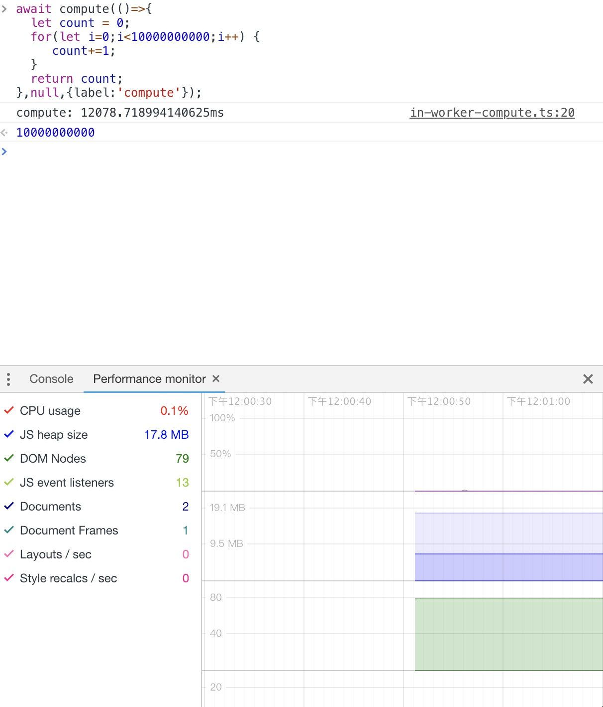
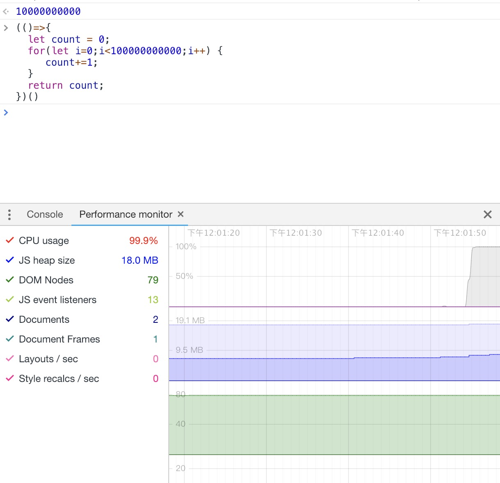

# compute in web worker

[](https://github.com/TenkaiRuri/compute)

Use the performance capabilities of `web worker` in the browser to avoid blocking the main thread

<figure style="text-align:center">
  
  <figcaption>use compute() api</figcaption>
</figure>

<figure style="text-align:center">
  
  <figcaption>not use</figcaption>
</figure>

## API:

### compute()

```js
/**
 * You can easily use `web worker`.
 * Using `web worker` is as easy as using a function, as natural as breathing.
 * The function will `dynamically` help you generate functions that communicate with the worker channel
 * It will be automatically closed when you are finished, so you don't have to worry about the performance problems.
 *
 * @template T
 * @param {(value?: T) => T} callback Function used for `calculation`
 * @param {T} [value] Parameters used for calculation
 * @param {debugOptions} [options={}] Debug option label:`string`,printScript:`boolean`
 * @returns {(Promise<T> | T)} Calculated result
 */
```

Note: Just in browser **_node.js_** side can't use

## TODO

[ ] add use case
